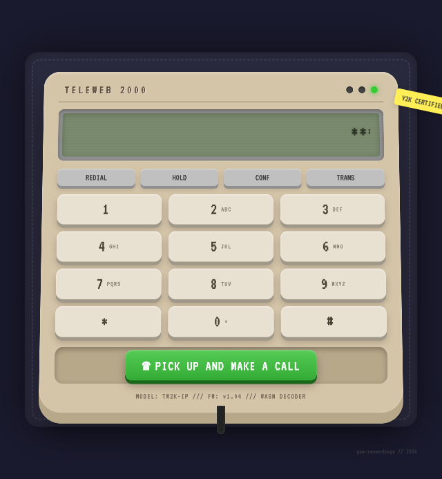

# TeleWeb 2000

A Y2K-era novelty desk phone simulator. Press the keypad for authentic DTMF tones, then hit **"Pick up and make a call"** to be connected to a random utility company's on-hold recording.

Yes, it works.

[Play it here](https://cbrunnkvist.github.io/teleweb-2000/)

## Features

- **Real-time DTMF tones** — Web Audio API sine wave generation with proper frequency pairs
- **In-browser GSM 06.10 decoder** — libgsm compiled to WebAssembly; the `.gsm` recordings are decoded entirely client-side
- **66 utility company IVR samples** — call centers from Anaheim to Montana, all circa 2018–2020
- **Responsive scaling** — fits vertically on any viewport like a real desk phone should
- **LCD scanlines** — character-cell display with typewriter effect and scrolling marquee

## Architecture

Single HTML file. No build step. No dependencies. 71 files total, 3.5 MB of hold music.

| Component | Size | What |
|---|---|---|
| `index.html` | ~30 KB | UI, CSS, JavaScript |
| `gsm_decoder.wasm` | 16 KB | libgsm compiled via Emscripten |
| `gsm_decoder.js` | 13 KB | Emscripten WASM glue |
| `gsm/*.gsm` | ~3.5 MB | 66 on-hold recordings |

## Technical details

- DTMF tones are generated on the fly using two `OscillatorNode`s per key (ITU-T frequency pairs) with attack/release envelopes to prevent clicking
- GSM decoding happens frame-by-frame: each 33-byte frame produces 160 PCM samples at 8 kHz
- Decoded PCM is wrapped into a WAV blob and played via `AudioContext.decodeAudioData()`
- The entire interface scales via CSS `transform: scale()` calculated from `offsetWidth`/`offsetHeight` — no media queries

## License

The code is mine. The recordings are public-domain hold messages recorded from utility company phone lines. The libgsm WASM build inherits the original TU Berlin libgsm copyright.
